  
各种依赖的作用

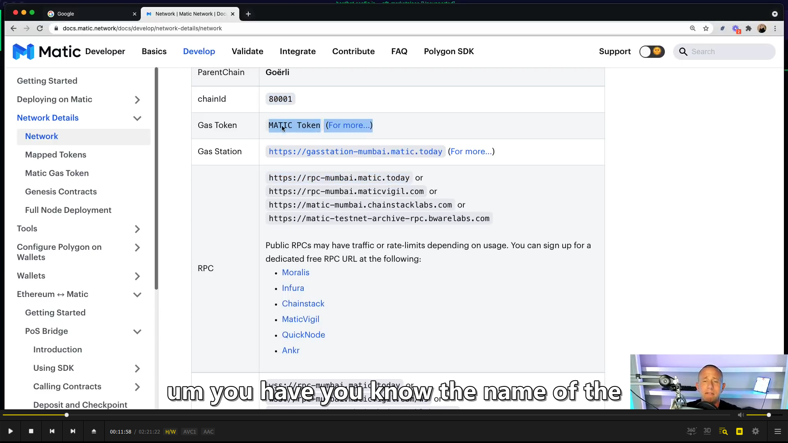  
matic doc

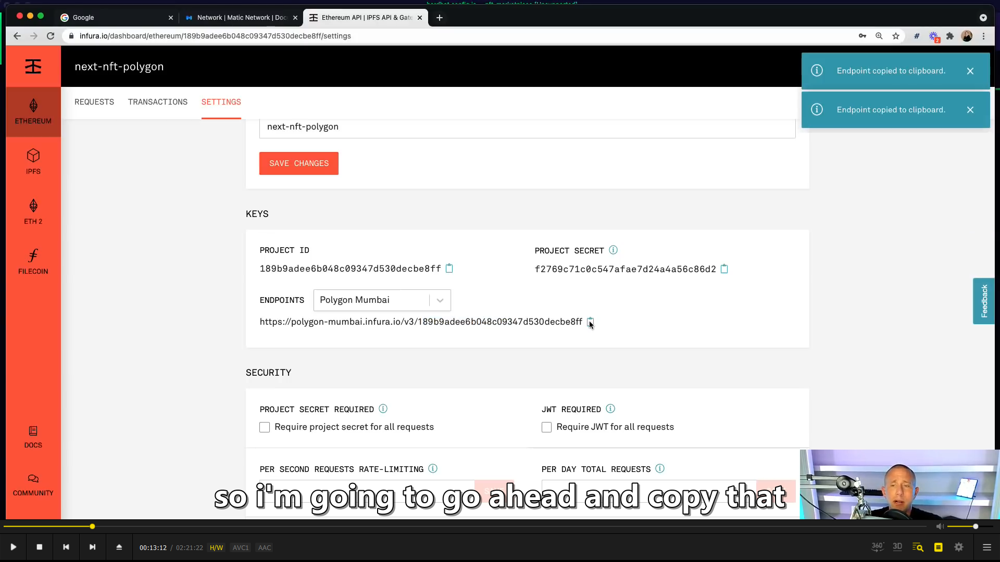  
公共节点可能会遇到过载问题，所以可以在 infura 自建节点

  
注意写法，${}，不想暴露 id 可以单独开个不上传的文件

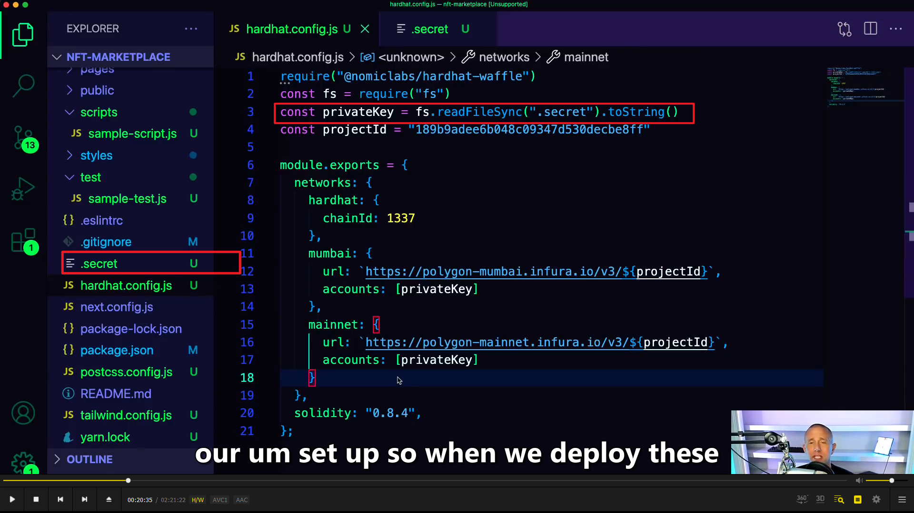  
安全引入 private key 的方法。

  
额外的 function， set token uri 去 set like it sounds the token uri。

  
用来增加数字

NFT 继承自 ERC721URIStorage 而 ERC721URIStorage 又继承自 ERC721

using A for B，可用于在合约的上下文中，将库函数（来自库 A）附加到任何类型（B）  
这里的 address 是 market contract 的。用来让 market contract 和 nft contract 交互。因为 nft 合约需要这个值，所以要先部署 market 合约，再部署 nft 合约。

  
这几个都是依赖里的方法，其中红框里的作用是让 market 合约拥有操作 nft 的权限。

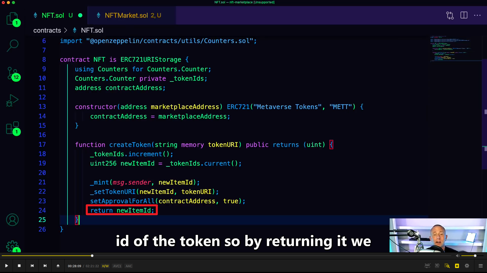  
想把 token 卖掉需要知道它的 id，所以返回它，客户端可以获知。

  
防止 re entry attack 的。

  
solidity 没有动态数组，所以需要知道数组长度，所以需要 itemsSold。

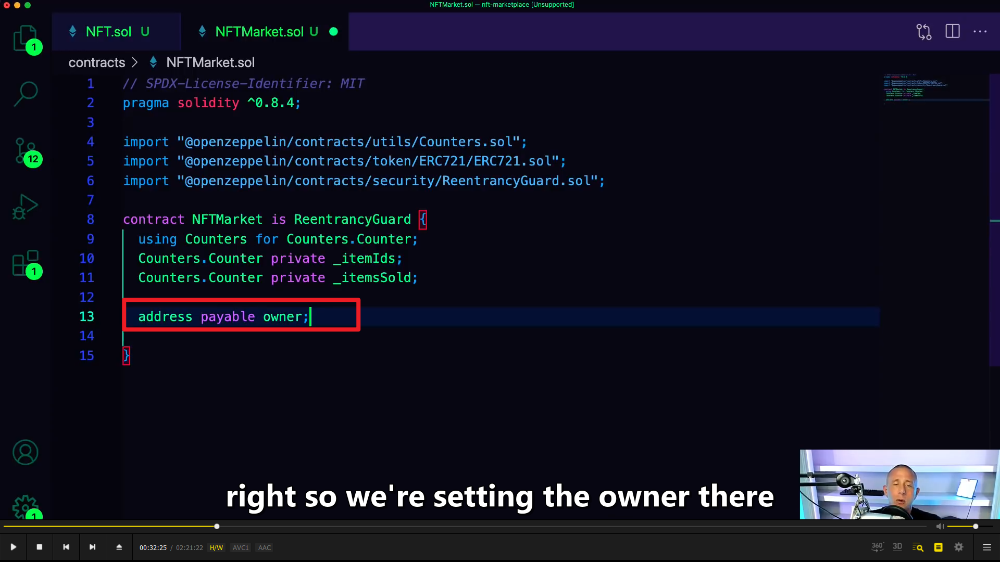  
设置 owner 可以方便获得佣金

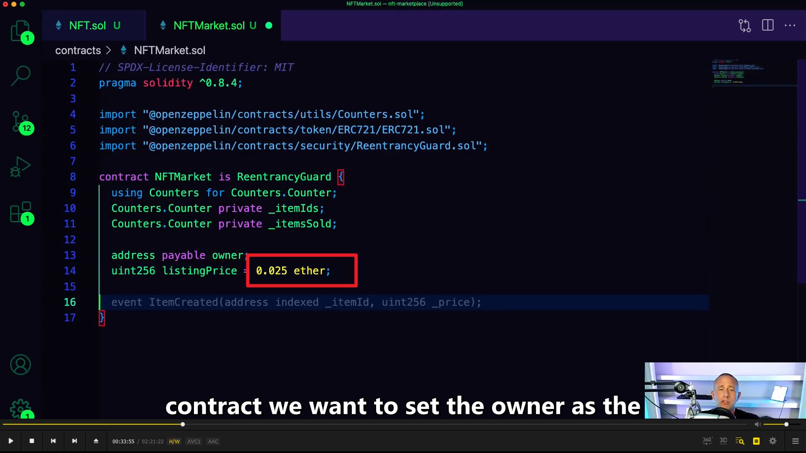  
尽管这里是 ether，但如果部署到 matic 网则是 matic。

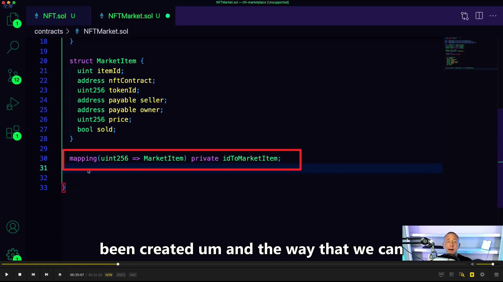  
为了追踪我们创造的 nft，所以创造一个 mapping，提供 item id，返回 market item。

  
一个 marketitem 被创建的时候产生的 event，提供给客户端

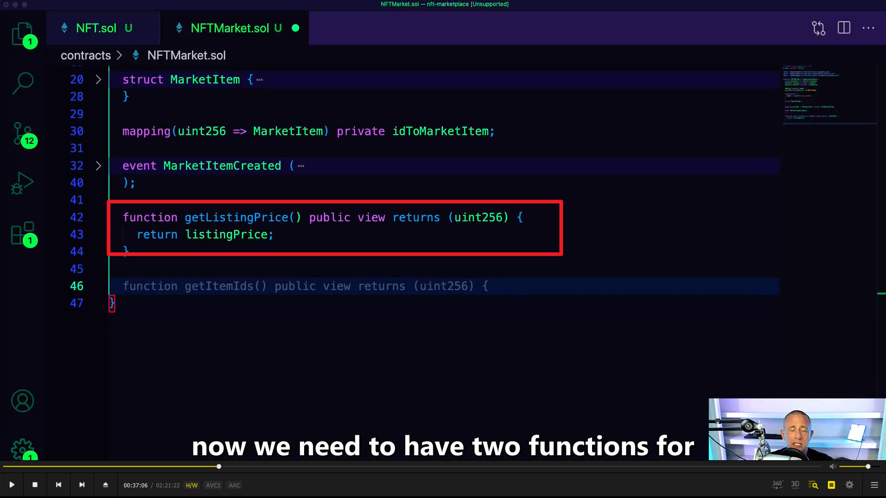
部署合约时，在前端不知道花多少钱能 list 一个 nft。可以直接 hardcode it，但最好的方法是 call contract，获得 listing price。确保我们输入了正确的数额。

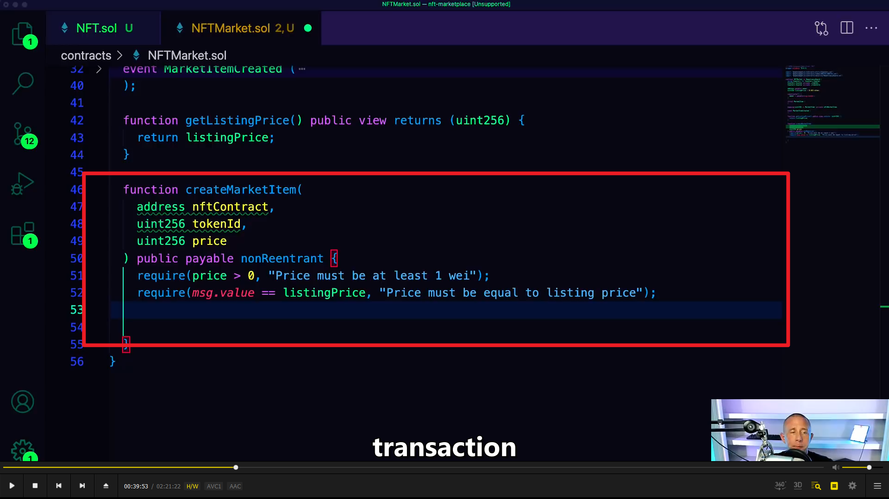
要创建两个 function，一个是这里的创建一个 nft 并拿去卖。（另一个是创造一个 market sale，没听懂）这里用了 nonReentrant modifier。创造 marketitem 时就要付出一些费用 pay for the listing，费用会锁在合约里。直到有人买了，费用才会转给 contract owner。

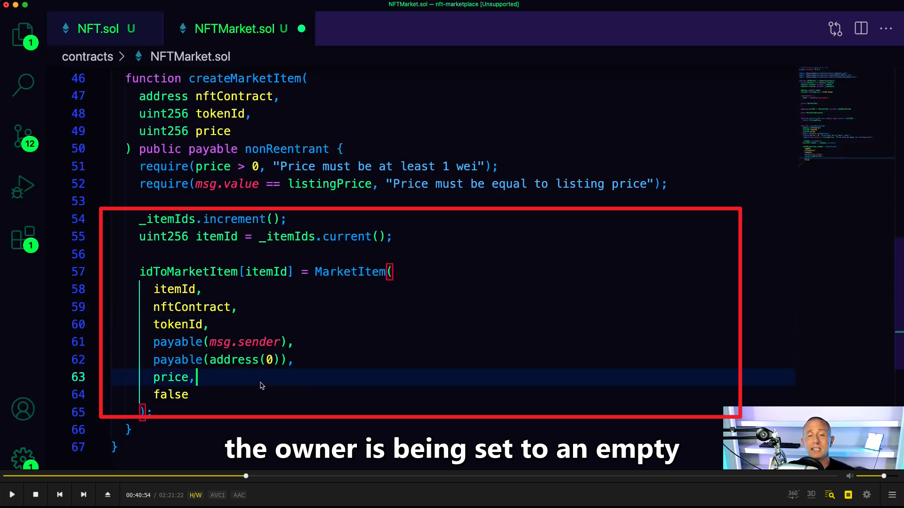  
用 mapping 的方法新增一个 nft。address(0)是 owner，目前是空地址。

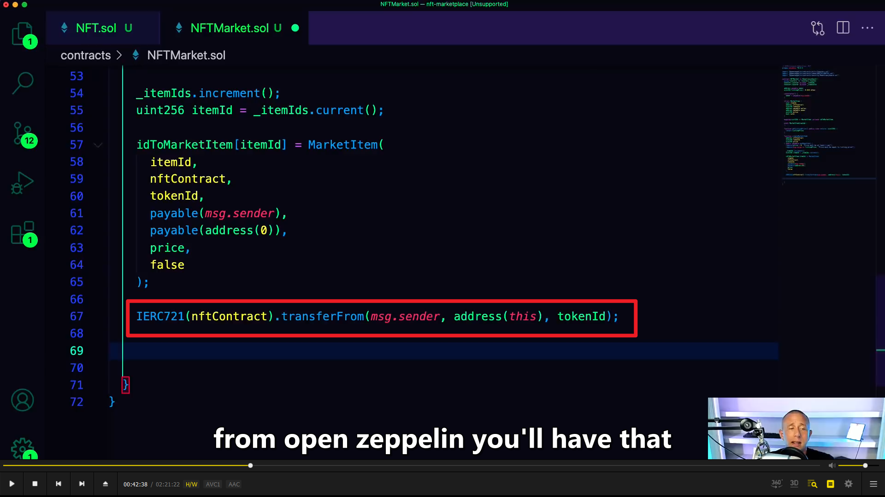
从写交易的人手里，把 nft 所有权转交给合约本身。之后再转让给下一个买家。

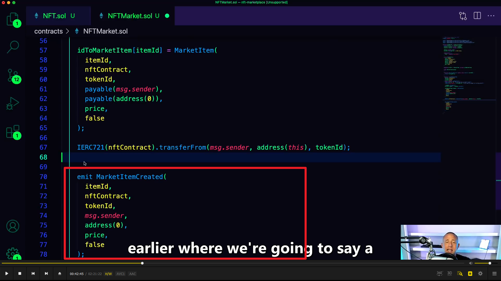  
emit the event that created earlier. 声明一个 marketitem 被创造了。

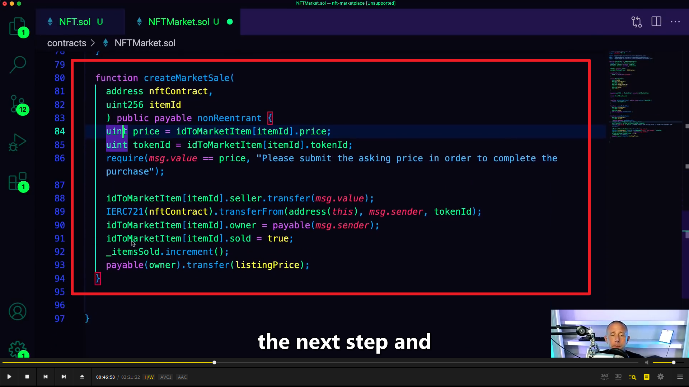  
createmarketsell,  
1，首先根据参数 payable 创造变量 price，token id。？？？其中 tokenid 不一定总是和 itemid 相同。  
2，把币的数量 msg.value 交给卖家。  
3，把所有权交给 msg.sender。from contract address（就是 adress（this））to msg.sender.  
4，set the local value for the owner to the message sender。

### 接下来的 functions 就是想要不同的 views，即不同的 collection selection sets。如创造的，已售的，未售的等。

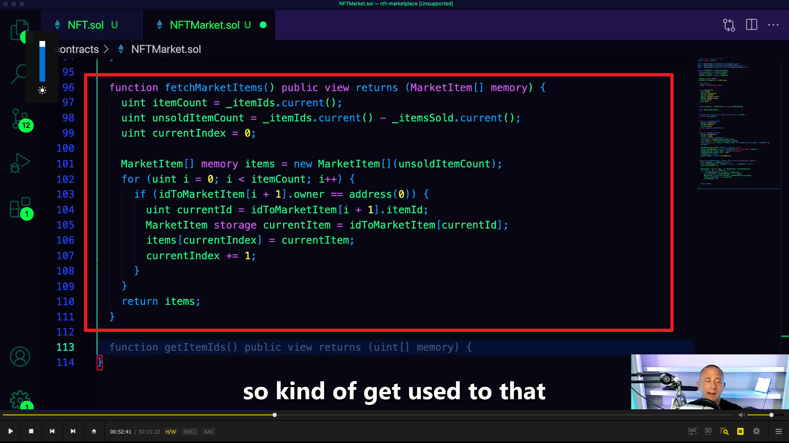
fetchmarketitems  
itemcount，已创建总数

we want to keep up with the local value for incrementing a number essentially,  
because we are going looping over an array and we want to keep up with a number within that loop/array.  
so in our case we are going be basically looping over the number of items created. and we want to increment that number if we basically have an empty address. that basically means if the item has an empty address that means it has not yet been sold.  
and we want to populate an array with that unsold item. and then we want to return that item. coz again, we only want to return from the function, the number of unsold item. 所以创建空数组 item。（大意是循环找到未出售的 item 并将它加入数组）

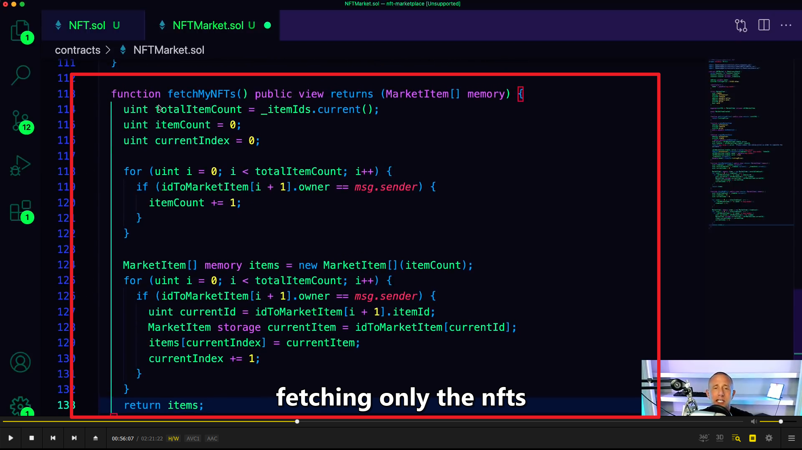
返回用户拥有的 nft。  
并没有一个 function 能返回我拥有了多少个 nft。只能返回总创建数，不能返回单个用户的创建数。所以就需要循环所有 item。

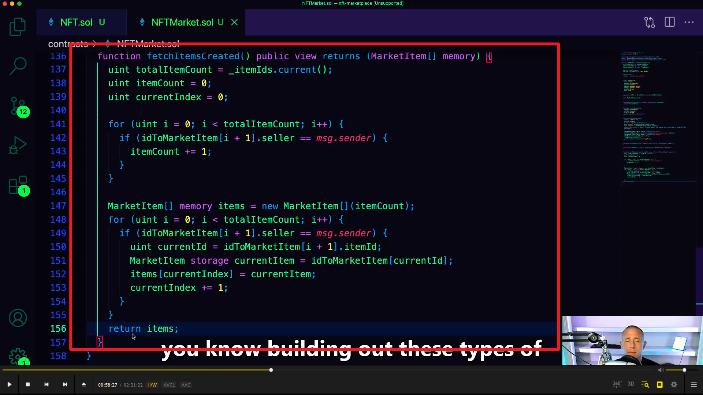
返回用户自己创建的 nft。类似上一个 function。

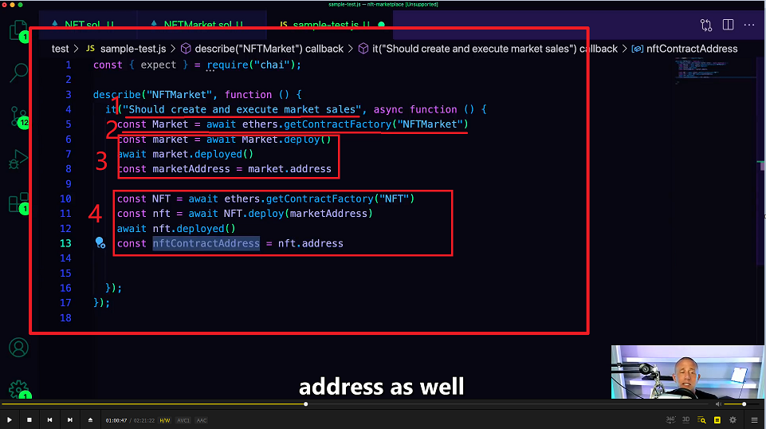      
写 test。  
1，目的是模拟部署两个合约，创建一个新的 nft，把新 nft 拿去卖，然后从别人手中买一个 nft。  
2，获得 market 合约的引用。（NFTMarket 为合约文件名，git clone 文件名为 Market.sol，但视频文件名为 NFTMarket.sol）  
3，等待合约部署完，然后获得合约地址的引用，因为部署 NFT 合约需要这个地址。  
4，部署 nft 合约。      

