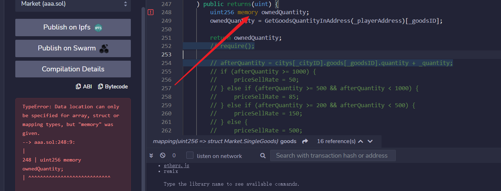

# 此文件用于记录 solidity 学习中从不同资料里获得的零星知识

---

### internal、private、external、public 区别

public 修饰的变量和函数，任何用户或者合约都能调用和访问。  
private 修饰的变量和函数，只能在其所在的合约中调用和访问，即使是其子合约也没有权限访问。  
internal 和 private 类似，不过， 如果某个合约继承自其父合约，这个合约即可以访问父合约中定义的“内部”函数。  
external 与 public 类似，只不过这些函数只能在合约之外调用 - 它们不能被合约内的其他函数调用。

### function 的修饰词，如 payable,view 等，如果没写，则是默认值 non-payable.

---

### constant view pure 关键字的区别与联系

  
如果函数使用了函数外的状态变量，只能用 view 修饰，使用 pure 修饰会报错。如果没有，则都可以修饰，但用 view 会有 warnning。

---

### 16 进制 big number 转 10 进制。合约里是 10 进制，但是前端返回确是 16 进制的 bignumber，所以需要转换下

parseInt(hex, 16)
其中 hex 代表 16 进制值。

(add,以上可能是错误的，需要将 16 改为 10)  
或者可以使用如下方法：  


```
const { ethers } require("ethers")
var a = "0x03"
var b = ethers.BigNumber.from(a)
var c = b.toNumber()
console.log(c)
```

---

### 函数体里设置如 uint 之类的临时变量，不能加 memory 之类的修饰词。



---

### 字符串之间不能直接互相对比，要做如图 abi.encode keccak256，对比 hash 值操作


---

### solidity 没有原生取绝对值的方法，但可以自己定义

https://ethereum.stackexchange.com/questions/121107/how-absolute-value-work-in-solidity

```
function abs(int x) private pure returns (int) {
    return x >= 0 ? x : -x;
}
```

返回值不能写为 uint ，原因见下条

---

### 如果参数是 int，即使知道返回值是非负数，也不能返回 uint。

  


---

### 求平方根，sqrt，无原生方法，自己定义

```
pragma solidity ^0.4.18;
contract  MathSqrt {
  function sqrt(uint x) public pure returns(uint) {
    uint z = (x + 1 ) / 2;
    uint y = x;
    while(z < y){
      y = z;
      z = ( x / z + z ) / 2;
    }
    return y;
  }
}

```

https://learnblockchain.cn/question/60

---

### 正负数相互转换，uint int 转换

When converting var from int to uint:

```
if(var < 0) {
    uint(-var);
}
else {
    uint(var);
}
```

When converting var from uint to int:

```
if(var >= uint(-1) {
    //can't cast - out of range of int max
}
else {
    int(var);
}
```

https://ethereum.stackexchange.com/questions/6947/math-operation-between-int-and-uint

```
     function Int2Uint(int256 _intA) public view returns (uint256) {
        if (_intA < 0) {
            return uint256(-_intA);
        } else {
            return uint256(_intA);
        }
    }

```

function 写法
