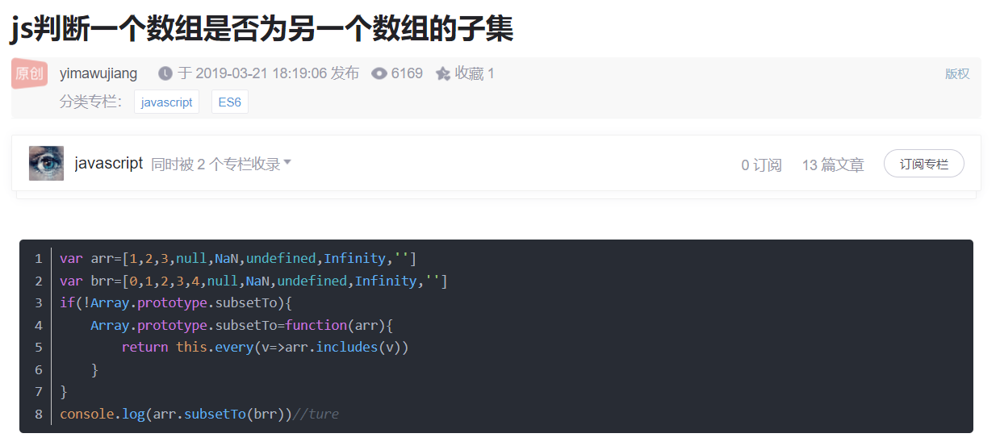

### 对象数组里面给每个对象添加新属性并赋值

```
  var arry = [
    { a: 11, b: 22, c: 33, d: 44 },
    { a: 11, b: 0, c: 0, d: 44 },
    { a: 11, b: 22, c: 99, d: 99 },
  ];
  var arry2 = [];
  arry.map((item, index) => {
    undefined;
    arry2.push(Object.assign({}, item, { mess1: item.c, mess2: item.d }));
  });
  console.log(arry2);
```

https://blog.csdn.net/bangu1962/article/details/101292936

---

### 取整，去掉小数点。双波浪线最方便

https://www.cnblogs.com/hikki-station/p/13792646.html  
JS 去掉小数点  
parseInt(3.14159) => 3  
~~3.14159 => 3  
还有：  
向上取整 Math.ceil(3.14159) => 4  
向下取整 Math.floor(3.14159) => 3  
四舍五入 Math.round(3.14159) => 3

---

## package.json 和 package-lock.json 的区别

https://zhuanlan.zhihu.com/p/343698322  
package-lock.json 是在运行“npm install”时生成的一个文件，用于记录当前状态下项目中实际安装的各个 package 的版本号、模块下载地址、及这个模块又依赖了哪些依赖。  
为什么有了 package.json，还需要 package-lock.json 文件呢，当 node_modules 文件夹并不存在或被删除时，需要用到 npm install 重新装载全部依赖时，通过 package-lock.json 可以直接表明下载地址和相关依赖，相对下载速度也更快，也不容易报错。

## 判断某数组中书否有重复值


## 有时候以为是数字的类型其实是字符串，就容易出现错误，可以 parseInt(string)转换为数字

## localStorage 用法。

https://www.csdn.net/tags/NtTaAgysNzM1NTQtYmxvZwO0O0OO0O0O.html  
localStorage.aaa = 'bbb';

//删除某个
localStorage.removeItem("hou")

//删除所有
localStorage.clear();

实际使用中，似乎需要在 localStorage 前加 window。

add, localStorage 似乎无法存储布尔值，false，true 会被视为字符串，可能会引起一些 bug。可用 aaa = bbb == "true" 这样来赋值 bbb 给 aaa。

## 一个数组删除另一个数组中拥有的所有元素


## 判断某数组是否是另一数组的子集。

  
https://blog.csdn.net/yimawujiang/article/details/88722195

```
var arr=[1,2,3,null,NaN,undefined,Infinity,'']
var brr=[0,1,2,3,4,null,NaN,undefined,Infinity,'']
if(!Array.prototype.subsetTo){
	Array.prototype.subsetTo=function(arr){
		return this.every(v=>arr.includes(v))
	}
}
console.log(arr.subsetTo(brr))//ture
```

## continue break return 区别

https://www.cnblogs.com/itgezhu/p/11226852.html  
简单来说 continue 单次循环不计，break 之后所有循环不计，return 不仅终止之后所有循环，还结束循环体之外函数体内之后的所有代码

## 后台输出的是[object Object]，看不到具体的内容，此时只需在前端页面上利用 JSON.stringify()将该传输数据转换成与 json 文件中格式一致就可以解决问题。

## 计算字符串长度

```
calculatebyte( sTargetStr ) {
     var sTmpStr, sTmpChar;
     var nOriginLen = 0;
     var nStrLength = 0;

     sTmpStr = new String(sTargetStr);
     nOriginLen = sTmpStr.length;

     for ( var i=0 ; i < nOriginLen ; i++ ) {
       sTmpChar = sTmpStr.charAt(i);

       if (escape(sTmpChar).length > 4) {
               nStrLength += 2;
       } else if (sTmpChar!='/r') {
               nStrLength ++;
       }
     }
     return nStrLength;
   },

```

## 保留小数点后几位，整数自动补零。

```
 getFloat(number, n) {
      n = n ? parseInt(n) : 0;
      if (n <= 0) {
        return Math.round(number);
      }
      number = Math.round(number * Math.pow(10, n)) / Math.pow(10, n); //四舍五入
      number = Number(number).toFixed(n); //补足位数
      return number;
    },
```


