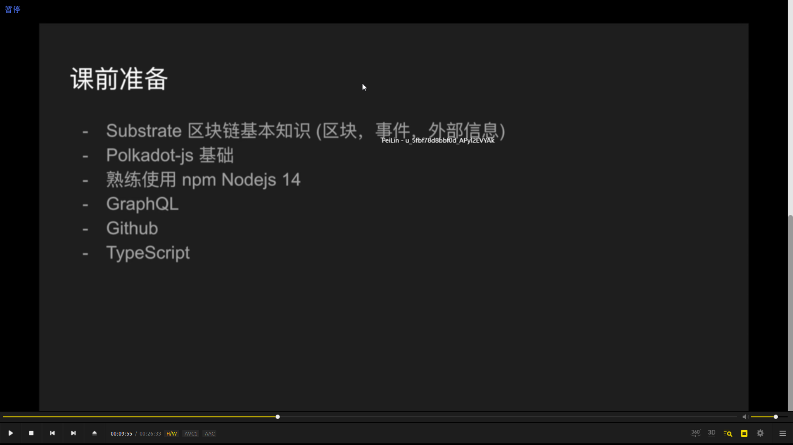
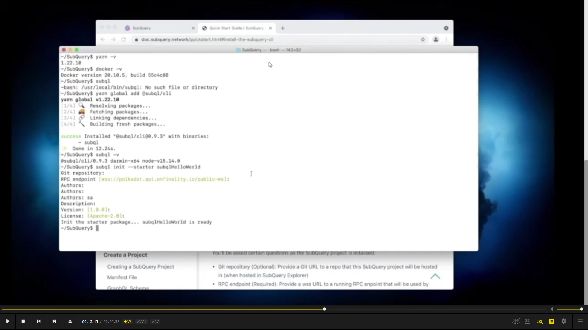
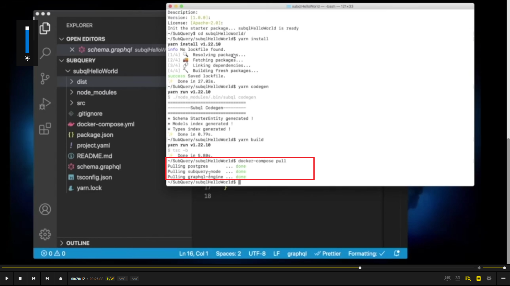
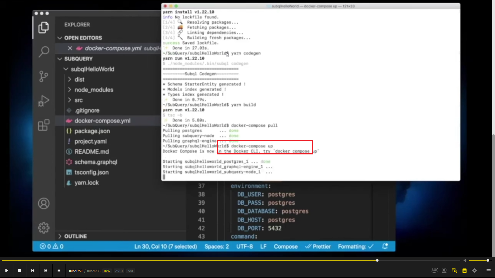

  
问题和解决方案

  
课前准备

  
工作原理

  
hello world + docker  
需要已有 yarn 和 docker  
再 npm install -g @subql/cli  
~~再 subql init --starter subqlHelloWorld 配置大多默认值，输入下作者就行~~  
由于更新，使用 subql init subqlHelloWorld，然后在后面的选项选 polkadot 和 subql-starter  
cd subqlHelloWorld  
yarn install  
yarn codegen （提取项目中 schema.graphql 定义的 entity，并生成对应的以 typescript 编译的实体 model）  
yarn build 完成编译，生成 dist 文件夹

  
docker-compose pull (需要打开 docker-desktop，不然会报错)

启动 docker 前，再看下工作原理  
已经拥有用户项目 subqlHelloWorld，subql/node，数据库，subql/query，graphql engine。使用 docker-compose up，这几个组件会协同工作。  
subqlnode 根据用户提供的？？？中的 endpoint 获取链上数据并缓存。  
数据库启动成功后 subqlnonde 会根据用户的 schema 文件让数据库中生成正确的数据库表。subqlnode 按照用户定义的 mapping 转换链上数据并储存在数据库表中。  
最终 subqlquery 和？ graphql engine 访问数据库，让我们通过 playground 和？api 查询这些已经转换的数据。

  
docker-compose up (会遇到报错，暂时未解决)      

