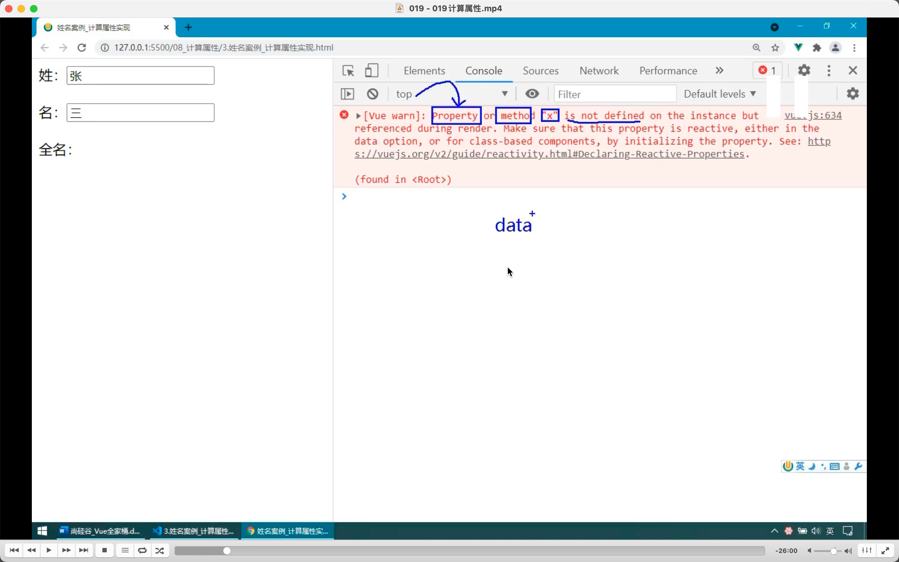
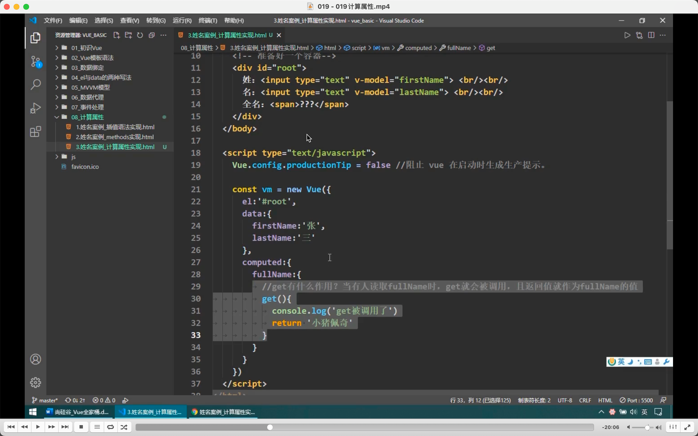
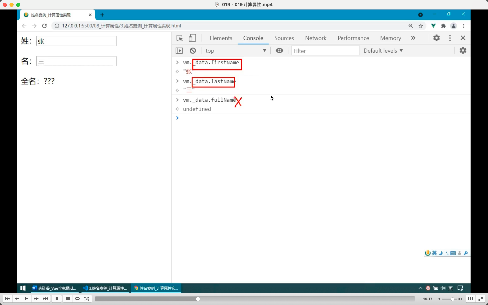
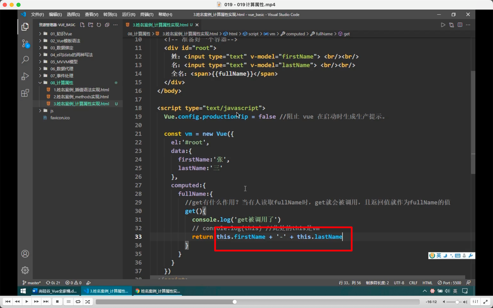
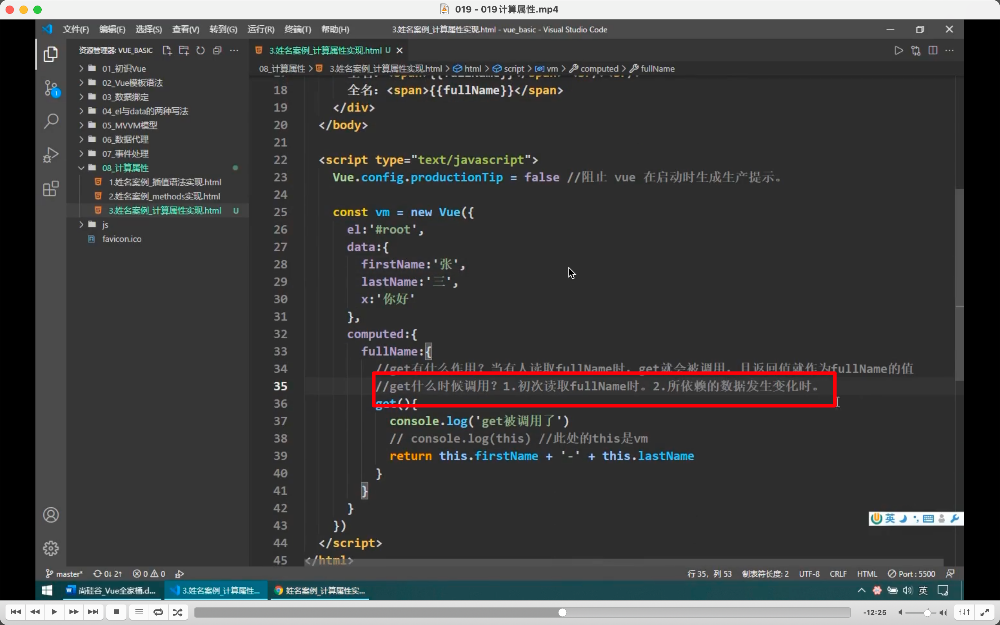

  
报错里的 property 就是 data。

  
计算属性就是用已经拥有的属性计算出来一个全新的属性。如这里 firstname，lastname 是属性，而 fullname 是计算属性。

计算属性需写为对象，且里面写 get。当有人读取 fullname 时，get 就会被调用，且返回值就是 fullname 的值，类似 defineproperty，其实底层就是用的 defineproperty。

  
vm.\_data 里没有计算属性，因为它不是本身就有而是被计算出来的。

  
计算属性 get 里拿 data 里的数据需要加上 this。vue 已经将 get 里的 this 变为了 vue 实例。

  
get 调用时机。1，初次调用，2，所依赖的数据发生变化后。其它时候就使用上次调用产生的缓存。
因为有缓存机制，所以比上节的 methods 方法更节省资源。
